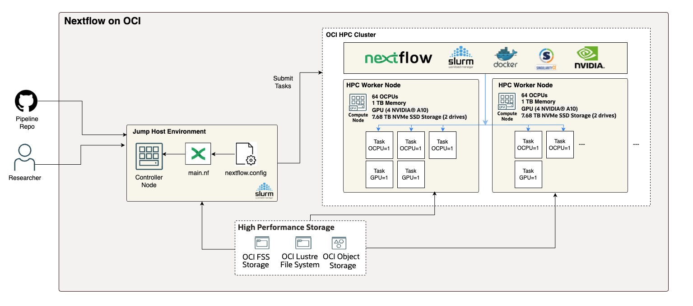

# Nextflow on OCI

This repo helps install nextflow on Oracle Cloud Infrastrucure (OCI) and help you run and manage nextflow pipelines using OCI's HPC Cluster with SLURM.

## Description
This repository provides a comprehensive toolkit for deploying, configuring, and managing Nextflow workflows on Oracle Cloud Infrastructure (OCI).

Nextflow is a powerful and popular system for creating scalable and reproducible scientific workflows. OCI offers highly performant and cost-effective bare metal compute instances ideal for High-Performance Computing (HPC) workloads.

The goal is to provide a straightforward path for researchers and bioinformaticians to run their existing Nextflow pipelines on an enterprise-grade cloud HPC environment, specifically using an OCI HPC Cluster powered by GPUs managed by the SLURM scheduler.

Key Features
Automated Installation: Includes scripts to provision and install Nextflow on an OCI compute inclusterstance (e.g., a cluster head node and worker nodes).

SLURM Scheduler Support: Enables Nextflow to seamlessly submit pipeline tasks as jobs to the SLURM scheduler, allowing for massive parallelization and efficient resource management across the cluster.

Data Management: Includes best practices and examples for staging data to and from OCI Object Storage for use in your pipelines.

### Built With And Supported By

* [Nextflow](https://www.nextflow.io/)
* [Ansible Playbooks](https://docs.ansible.com/ansible/latest/playbook_guide/playbooks_intro.html)
* [Oracle HPC and GPU with Terraform](https://cloudmarketplace.oracle.com/marketplace/en_US/listing/67628143)
* [Groovy](https://groovy-lang.org/)
* [Slurm](https://slurm.schedmd.com/)
* [Singularity](https://docs.sylabs.io/guides/3.5/user-guide/introduction.html)
* [Docker](https://www.docker.com/)
* [Nvidia Parabricks](https://docs.nvidia.com/clara/parabricks/latest/index.html)

---

## Table of Contents

* [Installation](#installation)
* [Usage](#usage)
* [Features](#features)
* [Roadmap](#roadmap)
* [Contributing](#contributing)
* [License](#license)
* [Contact](#contact)
* [Acknowledgements](#acknowledgements)

---

## Installation

TBD

**Prerequisites**

TBD

**Steps**

TBD

---

## Usage

TBD