# Nextflow on OCI
[](https://github.com/dkhopade/nextflow-on-oci/issues)
[](https://github.com/dkhopade/nextflow-on-oci/stargazers)


This repo helps install nextflow on Oracle Cloud Infrastrucure (OCI) and help you run and manage nextflow pipelines using OCI's HPC Cluster with SLURM.

## Description
This repository provides a comprehensive toolkit for deploying, configuring, and managing Nextflow workflows on Oracle Cloud Infrastructure (OCI).

Nextflow is a powerful and popular system for creating scalable and reproducible scientific workflows. OCI offers highly performant and cost-effective bare metal compute instances ideal for High-Performance Computing (HPC) workloads.

The goal is to provide a straightforward path for researchers and bioinformaticians to run their existing Nextflow pipelines on an enterprise-grade cloud HPC environment, specifically using an OCI HPC Cluster powered by GPUs managed by the SLURM scheduler.

Key Features
Automated Installation: Includes scripts to provision and install Nextflow on an OCI compute inclusterstance (e.g., a cluster head node and worker nodes).

SLURM Scheduler Support: Enables Nextflow to seamlessly submit pipeline tasks as jobs to the SLURM scheduler, allowing for massive parallelization and efficient resource management across the cluster.

Data Management: Includes best practices and examples for staging data to and from OCI Object Storage for use in your pipelines.

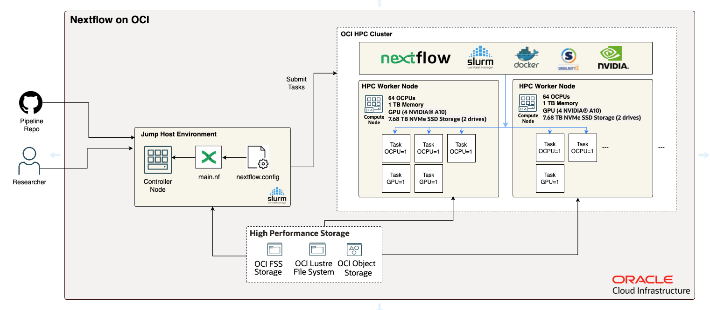

### Built With And Supported By

* [Nextflow](https://www.nextflow.io/)
* [Ansible Playbooks](https://docs.ansible.com/ansible/latest/playbook_guide/playbooks_intro.html)
* [Oracle HPC and GPU with Terraform](https://cloudmarketplace.oracle.com/marketplace/en_US/listing/67628143)
* [Groovy](https://groovy-lang.org/)
* [Slurm](https://slurm.schedmd.com/)
* [Singularity](https://docs.sylabs.io/guides/3.5/user-guide/introduction.html)
* [Docker](https://www.docker.com/)
* [Nvidia Parabricks](https://docs.nvidia.com/clara/parabricks/latest/index.html)

---

## Table of Contents

* [Installation](#installation)
* [Prerequisites](#prerequisites)
* [Usage](#usage)
* [License](#license)
* [Help](#help)
* [Acknowledgements](#acknowledgements)

---

## Installation
**installation**

### Step 1: Build OCI HPC Cluster Enabled with Slurm
Install the HPC GPU cluster from OCI's Marketplace. The terraform based stack is free to use within your OCI tenancy. It will create all the necessary resources required for you so that you dont have to deal with all the complexities building the stack such as terraform scripts to create VCNs, Compute Clusters, its configurations etc. 

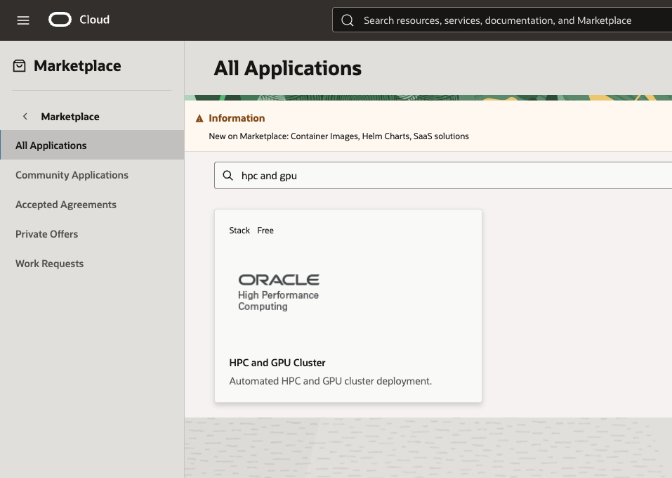

Launch Stack:
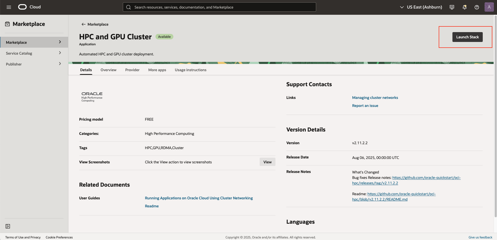

Accept Stack Terms:
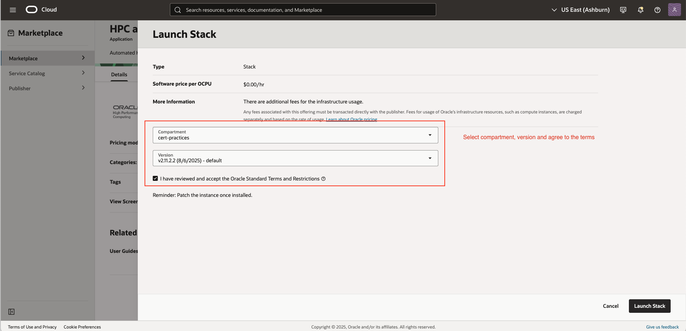

Fillout Stack Details (ideally terraform variables):
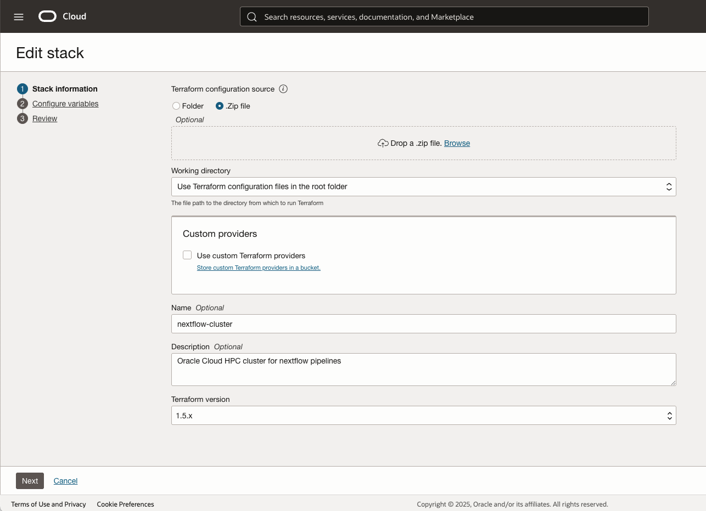

Configure Stack Details:
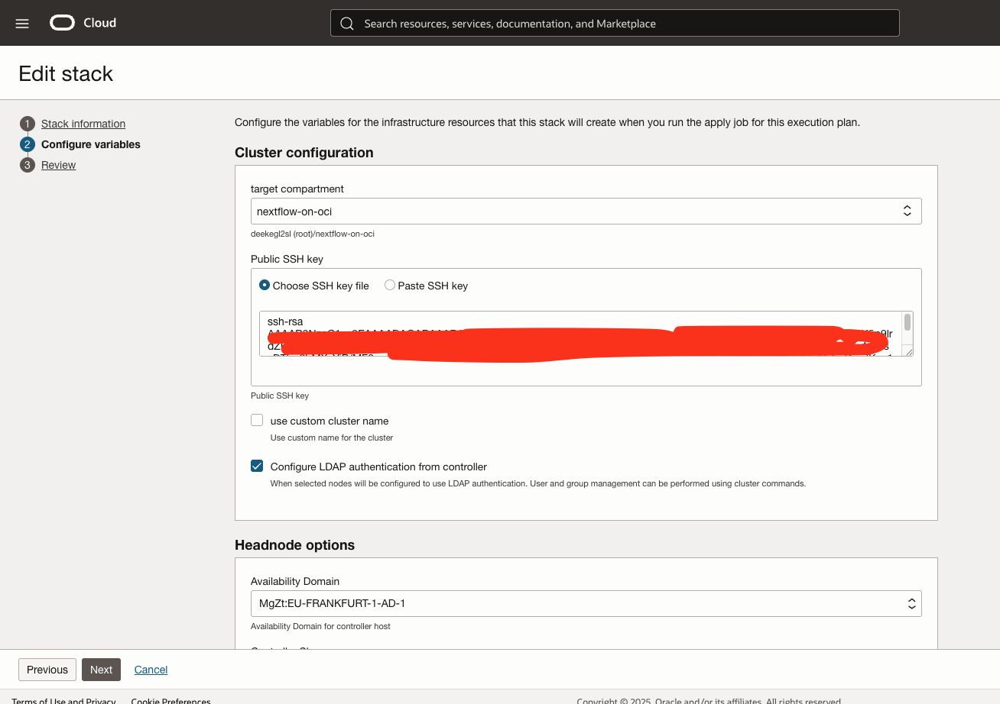

Configure Headnode (aka Controller/login) for Slurm:
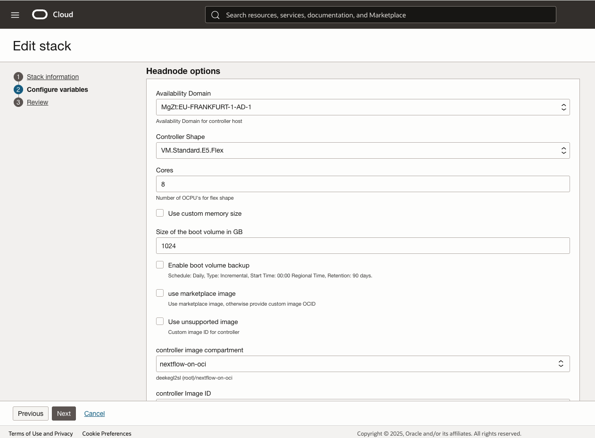

Configure Compute Node with GPUs:
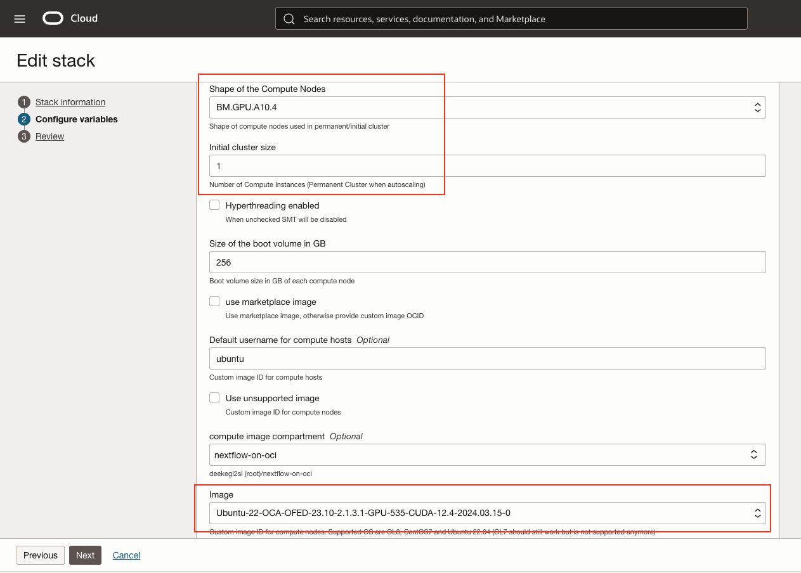

Make sure to slect Slurm (Slurm is required for HPC cluster management and job scheduling):
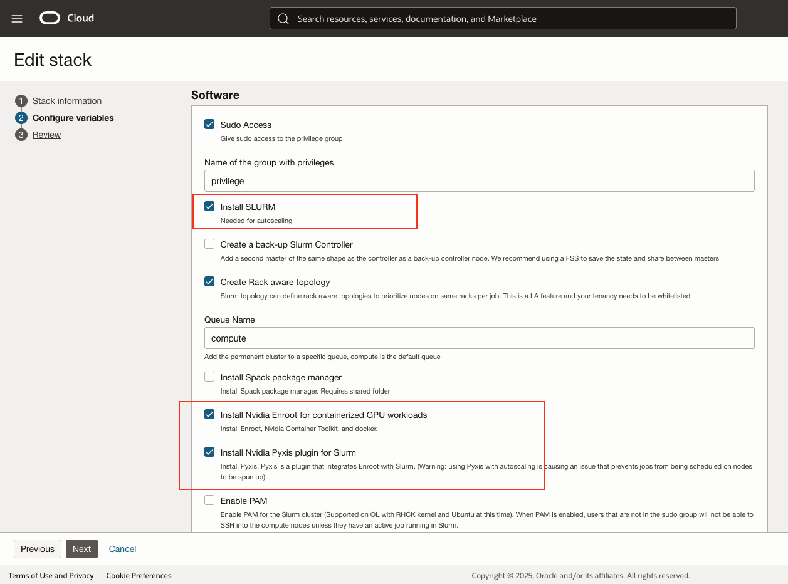

Once the stack is applied, you can verify the resources created:
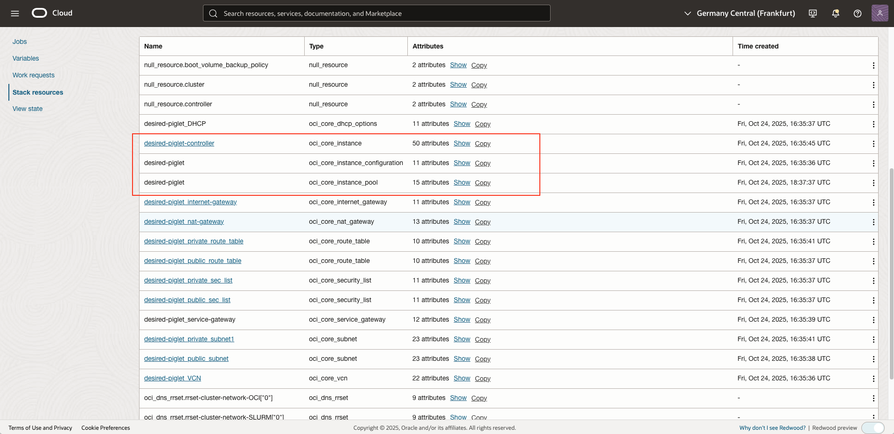

You can verify the GPU node for number of details for GPUs and other compute resources configured for this cluster nodes:
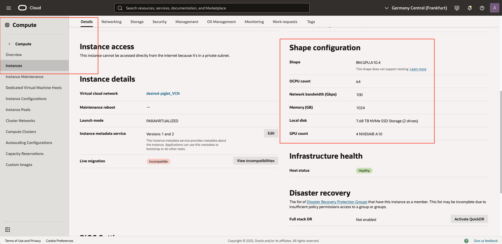

### Step 2 Install Nextflow: 
Install the nextflow using ansible playbook. Locate the `ansible-playbooks/` folder in this repository. Adjust any versions or dependencies as required. Once verified, run below command:
```
ansible-playbook nextflow-install.yml
```
Once the installation is completed, it shows you the appled steps like below:
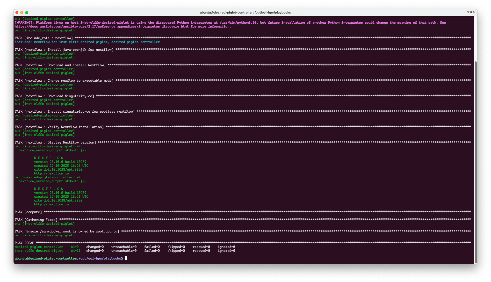

You can also verify to make sure you have the desired version and the nextflow command is available globally on your controller as well as compute node:
```
nextflow -v
```

## Prerequisites
**Prerequisites**
- [OCI Tenancy](https://docs.oracle.com/en-us/iaas/Content/FreeTier/freetier.htm)
- [Slurm](https://slurm.schedmd.com/)
- [Compute with GPUs](https://docs.oracle.com/en-us/iaas/Content/Compute/References/computeshapes.htm)
- [Docker](https://www.docker.com/)
- [Singularity](https://docs.sylabs.io/guides/3.5/user-guide/introduction.html)
- [Ansible](https://docs.ansible.com/)
- [Terraform](https://developer.hashicorp.com/terraform)
- [Nextflow](https://www.nextflow.io/)
- [NVIDIA SMI CLI Tool](https://docs.nvidia.com/deploy/nvidia-smi/index.html)

---

## Usage
**usage**

### Run nextflow pipelines: 
Once the installation is confirmed, you can start running your pipelines. For a simple pipeline we will be running it from the instructions provided in `README.md` provided in a folder  `nextflow-pipelines/parabricks-nextflow`.

When you run the pipeline, this is what is expected on your console. To showcase the use of CPUs and GPUs, you can see the `htop` and `nvidia-smi` processes running in seaprate console. Those metrics are running directly from the compute node and not the controller node. Controller node will use Slurm to schedule the tasks to run on compute nodes:
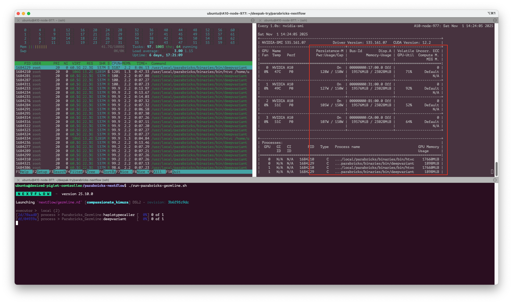

Once the pipeline execution is finished, you can see the below output. Unfortunatley the GPU stats are not yet printed by nextflow, however you can refer in the above picture how all 4 GPUs were utilized by this pipeline which is 100% designed to run on GPUs than CPU to acclerate pipeline execution. 

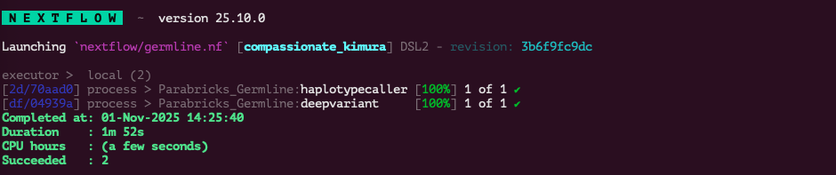

The pipeline also produces 2 kind of reports (), one to show the excution summary and resource utilizations, and the other report is a diagram shows the exectution flow for all the processes in the pipeline, its also called DAG (Refer more: https://nextflow.io/docs/latest/developer/nextflow.dag.html).

* [Execution Summary Report](nextflow-pipelines/parabricks-nextflow/example-reports/report.html)
* [DAG Report](nextflow-pipelines/parabricks-nextflow/example-reports/germline-dag.html)

---

## License
**license**
Copyright (c) 2025 Oracle and/or its affiliates.

Licensed under the Universal Permissive License (UPL), Version 1.0.

See [LICENSE](LICENSE.txt) for more details.
---

## Help
**help**
Open an issue in this repository.
For issues with OCI HPC Stack from Marketplace, submit issues under this repo: (https://github.com/oracle-quickstart/oci-hpc)

---

## Acknowledgements
**acknowledgements**
- Special thanks to all the contributors from OCI-HPC Team (https://github.com/oracle-quickstart/oci-hpc/graphs/contributors).
- [Ruzhu Chen](https://github.com/ruzhuchen), Master Principal Cloud Architect | Oracle OCI AI/HPC
- [Animesh Sahay](https://www.linkedin.com/in/animesh-sahay/), Senior Enterprise Architect | Oracle OCI AI/HPC
- [Deepak Khopade](https://github.com/dkhopade), Master Principal Cloud Architect | Oracle OCI Healthcare

